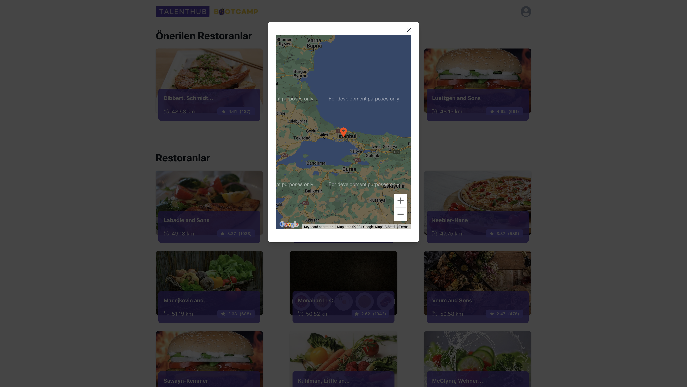
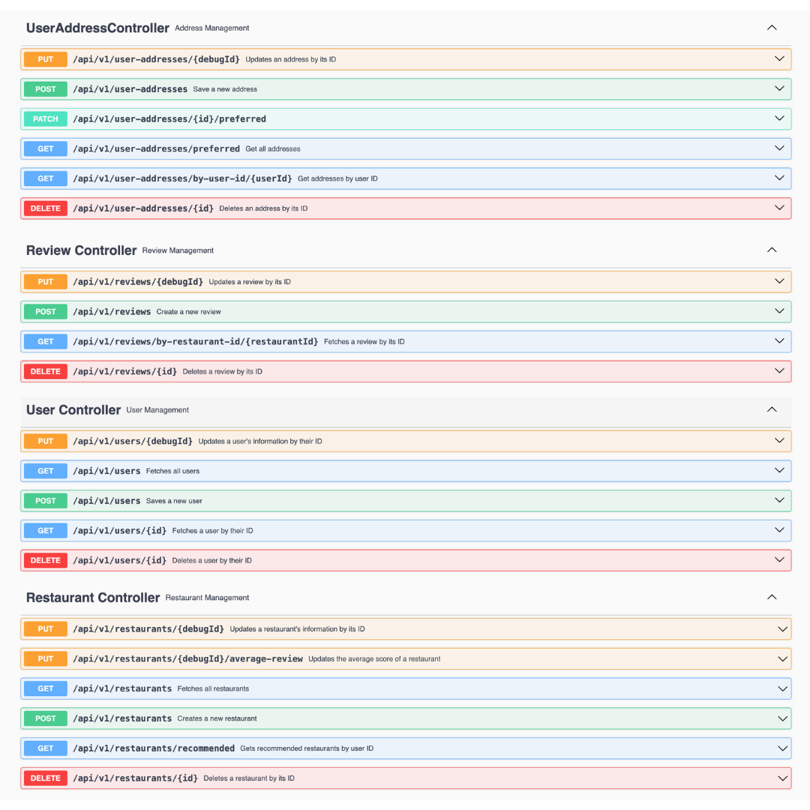

# N11 Talenthub Bootcamp Graduation Project

## Installation:

1. Clone this repository to your local machine.
2. Navigate to the project directory.
3. Open terminal ant type `docker compose up`.
4. Start Service Registry.
4. Start Restaurant, Review and Log services.
5. Start API Gateway.

## Screenshots:

### Frontend:

### Controllers:

## Services

### User Service

| Method Name                 | Explanation                                                            |
|-----------------------------|------------------------------------------------------------------------|
| `save(UserSaveRequest)`     | Saves a new user based on the provided user details.                   |
| `findAll(QueryParams)`      | Retrieves all users based on pagination parameters.                    |
| `findById(Long)`            | Finds a user by their unique ID and returns their details.             |
| `delete(Long)`              | Deletes a user based on their unique ID.                               |
| `update(UserUpdateRequest)` | Updates an existing user with new information provided in the request. |

### User Address Service

| Method Name                              | Explanation                                                                                              |
|------------------------------------------|----------------------------------------------------------------------------------------------------------|
| `save(UserAddressSaveRequest)`           | Saves a new user address for a specific user. It also marks the new address as preferred for the user.   |
| `findAllByUserId(Long)`                  | Retrieves all user addresses associated with a specific user based on the user's ID.                     |
| `getPreferredUserAddress(Long)`          | Retrieves the preferred user address for a given user ID.                                                |
| `delete(Long)`                           | Deletes a user address based on its unique ID.                                                           |
| `update(UserAddressUpdateRequest)`       | Updates an existing user address with new information provided in the request.                           |
| `changePreferredUserAddress(Long, Long)` | Changes the preferred user address for a given user ID to the address with the provided user address ID. |
| `findUserAddressById(Long)`              | Finds a user address by its unique ID and returns its details.                                           |

### Review Service

| Method Name                                  | Explanation                                                                                                                                              |
|----------------------------------------------|----------------------------------------------------------------------------------------------------------------------------------------------------------|
| `save(ReviewSaveRequest)`                    | Saves a new review submitted by a user for a restaurant. It calculates the average rating for the restaurant and updates it accordingly.                 |
| `findAllByRestaurantId(String, QueryParams)` | Retrieves all reviews submitted for a specific restaurant based on its unique ID.                                                                        |
| `delete(Long)`                               | Deletes a review based on its unique ID. It also updates the average rating for the associated restaurant.                                               |
| `update(ReviewUpdateRequest)`                | Updates an existing review with new information provided by the user. It recalculates the average rating for the associated restaurant after the update. |

### Restaurant Service

| Method Name                                   | Explanation                                                                                                                                                 |
|-----------------------------------------------|-------------------------------------------------------------------------------------------------------------------------------------------------------------|
| `save(RestaurantSaveRequest)`                 | Saves a new restaurant into the system with the provided details. It calculates the initial average rating and sets it to 5.0.                              |
| `findAll(QueryParams)`                        | Retrieves all restaurants stored in the system.                                                                                                             |
| `getRecommendedRestaurantsWithin10Km(Long)`   | Fetches recommended restaurants based on the user's location within a 10-kilometer radius. It utilizes the user's address to determine the recommendations. |
| `updateAverageRate(AverageRateUpdateRequest)` | Updates the average rating of a restaurant based on user reviews. It adjusts the average rating and total reviews count accordingly.                        |
| `delete(String)`                              | Deletes a restaurant from the system based on its unique ID.                                                                                                |
| `update(RestaurantUpdateRequest)`             | Updates the information of an existing restaurant with new details provided.                                                                                |

## Entities

### PostgreSQL Entities

#### User Entity

- **Table Name:** `users`

| Field Name | Type   | Description                    |
|------------|--------|--------------------------------|
| id         | Long   | Primary key auto-generated ID. |
| username   | String | Username of the user.          |
| name       | String | Name of the user.              |
| surname    | String | Surname of the user.           |

#### Review Entity

- **Table Name:** `reviews`

| Field Name   | Type   | Description                                   |
|--------------|--------|-----------------------------------------------|
| id           | Long   | Primary key auto-generated ID.                |
| restaurantId | String | Identifier for the restaurant being reviewed. |
| rate         | Double | Rating given to the restaurant (1.0 to 5.0).  |
| comment      | String | Optional comment about the restaurant.        |
| user         | User   | User who submitted the review.                |

### Solr Entities

#### Restaurant Entity

- **Collection Name:** `restaurants`

| Field Name        | Type    | Description                                    |
|-------------------|---------|------------------------------------------------|
| id                | String  | Primary key auto-generated ID.                 |
| name              | String  | Name of the restaurant.                        |
| imageSrc          | String  | Image source URL of the restaurant.            |
| geo               | String  | Geographic location of the restaurant.         |
| averageRate       | pdouble | Average rating of the restaurant (1.0 to 5.0). |
| totalReviewsCount | plong   | Total number of reviews for the restaurant.    |

## Exception Handler

Handles exceptions thrown by the application.

- `Exception:` Handles all exceptions. Returns an error message with status code 500.
- `ItemNotFoundException:` Handles item not found exceptions. Returns an error message with status code 404.
- `MethodArgumentNotValidException:` Handles validation errors in request parameters. Returns field errors with status
  code 400.

